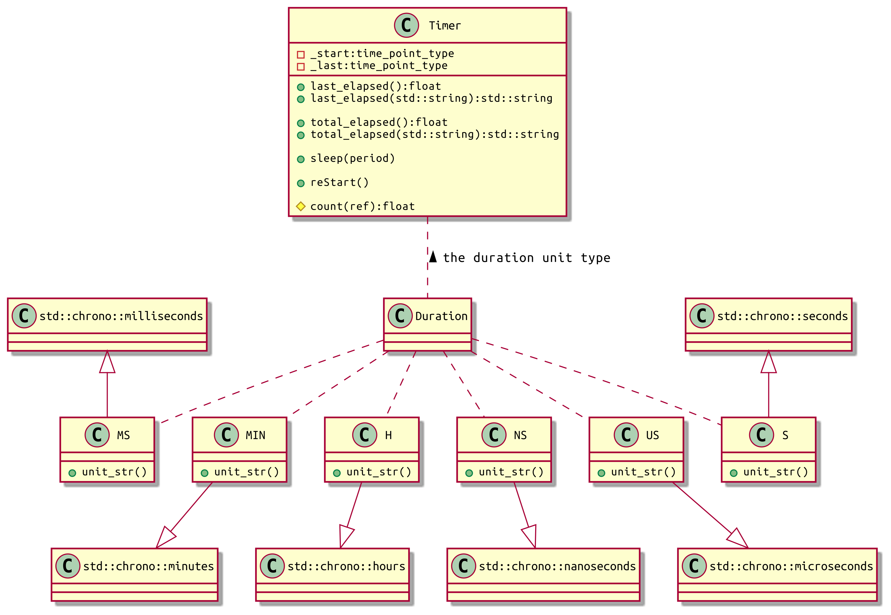
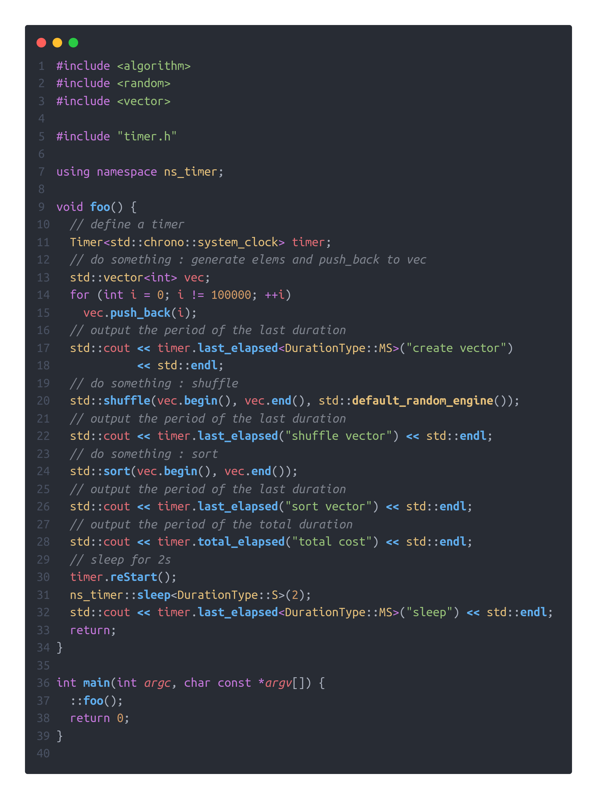

# DurationTimer

[TOC]

___Author___

___name___ ShuoLong Chen  
___eamil___ 3079625093@qq.com

```cpp
  _|      _|                                      
_|_|_|_|      _|_|_|  _|_|      _|_|    _|  _|_|  
  _|      _|  _|    _|    _|  _|_|_|_|  _|_|      
  _|      _|  _|    _|    _|  _|        _|        
    _|_|  _|  _|    _|    _|    _|_|_|  _|       
```


[TOC]

## 1. OverView

___Timer___ is a c++ template class for timer. You can use it easily to count the ran time.This time statistics class provides two timing methods: ___last_elapsed___ and ___total_elapsed___. The detail ans example are below.  
And because it's a template class, you can just copy the head file and use it easily.

## 2. Structure



## 3. Usage Example

___Code___



___output___
```log
# debug
{create vector: 3.888439(ms)}
{shuffle vector: 12.342250(ms)}
{sort vector: 30.742424(ms)}
{total cost: 46.995686(ms)}
{sleep: 2.000096(s)}

# release
{create vector: 1.025685(ms)}
{shuffle vector: 2.621002(ms)}
{sort vector: 9.609744(ms)}
{total cost: 13.280755(ms)}
{sleep: 2.000092(s)}
```

## 4. APIs
___TimeUnit___ 

```cpp
struct TimeUnit {
 public:
  /**
   * @brief time units in the std::chrono
   */
  using ns = std::chrono::nanoseconds;
  using us = std::chrono::microseconds;
  using ms = std::chrono::milliseconds;
  using s = std::chrono::seconds;
  using min = std::chrono::minutes;
  using h = std::chrono::hours;
}
```

___sleep(const typename DurationType::rep &period)___

```cpp
/**
 * @brief sleep for the 'period'
 *
 * @tparam DurationType the type of duration
 * @param period the time to sleep
 */
```

___Timer Constructor___ 

```cpp
// the constructor
Timer<ClockType>();
/**
 * @brief the Timer class to timing
 * 
 * @tparam ClockType the type of the clock used, eg:std::chrono::system_clock
 */

// examples: 
DurationTimer<> default_timer;

DurationTimer<std::chrono::system_clock> sysc_timer;

DurationTimer<std::chrono::high_resolution_clock> hrc_timer;

DurationTimer<std::chrono::system_clock> sedc_timer;

```

___reStart()___

```cpp
/**
 * @brief restart the timer
 */
```

___last_elapsed()___ 

```cpp
/**
 * @brief get the last duration from the 'start' time point to 'now' time point
 * 
 * @tparam DurationType the type of std::duration, eg: std::chrono::milliseconds, std::chrono::seconds
 * @return float the duration count
 */
```
___total_elapsed()___ 

```cpp
/**
 * @brief get the total duration from the 'start' time point to 'now' time point
 * 
 * @tparam DurationType the type of std::duration, eg: std::chrono::milliseconds, std::chrono::seconds
 * @return float the duration count
 */
```
___last_elapsed(const std::string &desc)___ 

```cpp
/**
 * @brief get the last duration from the 'start' time point to 'now' time point
 * 
 * @tparam DurationType the type of std::duration, eg: std::chrono::milliseconds, std::chrono::seconds
 * @param desc the describe of this duration
 * @return std::string the duration string
 */
```
___total_elapsed(const std::string &desc)___ 

```cpp
/**
 * @brief get the total duration from the 'start' time point to 'now' time point
 * 
 * @tparam DurationType the type of std::duration, eg: std::chrono::milliseconds, std::chrono::seconds
 * @param desc the describe of this duration
 * @return std::string the duration string
 */
```
